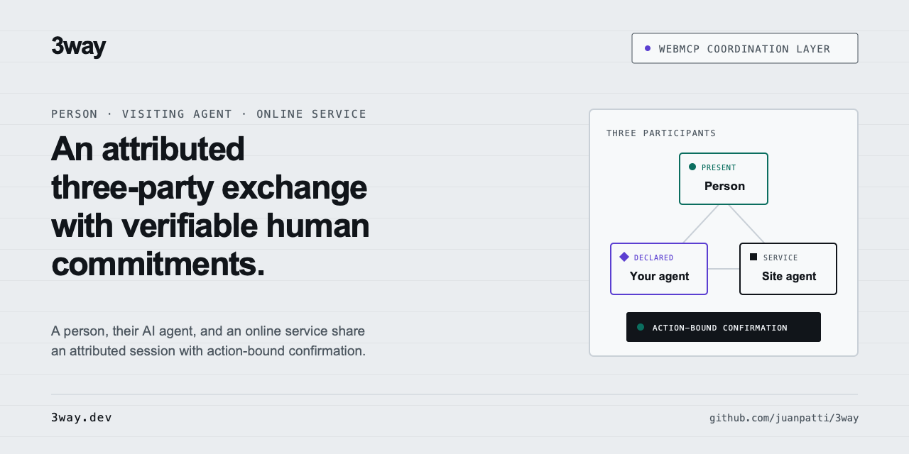

# 3way

**An attributed three-party exchange with verifiable human commitments, built on WebMCP.**

3way is a WebMCP coordination layer for exchanges involving a person, their AI agent, and
an online service. All three share an attributed session: the agents can exchange context,
negotiate, and invoke domain tools, while defined commitments can require an action-bound
confirmation from the person.

[Live site](https://3way.dev/) ·
[Shop exchange](https://3way.dev/demo/halden/) ·
[Clinical-records exchange](https://3way.dev/demo/clinic/) ·
[GitHub repository](https://github.com/juanpatti/3way)



## What 3way enables

3way is the trust WebMCP needs before people let agents act for them: the site knows who is
really acting, the visiting agent knows what it is calling and what happened, and the person
keeps the final say.

- **The site** knows who is really talking and who is in control: every line carries the
  channel it came through — the person's own path or the declared agent channel — and a
  consequential action executes only after the Worker verifies a gesture bound to that one
  action.
- **The visiting agent** knows what it is talking to and what happened: it calls the page's
  own declared tools on the origin it visited, and every result says what was done, what was
  not, and what needs the person.
- **The person** understands the exchange and has the final say: they read every line,
  attributed to who said it, in plain language, and hold the only key; in Composer mode they
  can also interrupt it and supply missing information.
- Consequential actions are prepared first, confirmed against an explicit subject, and
  executed by an authoritative server-side gate.

### Keyholder mode — the default

The site's agent and your agent transact in one open, attributed ledger. The only
thing you do — the only thing you *can* do — is authorize the consequential steps
with a hardware gesture no agent can forge. There is no text composer, so there is
no human-typing surface for an agent to impersonate; authority lives in the gate,
not in a box.

**Composer mode** is the opt-in where the person can also speak in the thread —
selected per page with `data-3way-input="composer"` (or `mount({ composer: true })`).
The clinic runs Composer mode because its disclosure flow needs information only
the person can supply.

## Try the live exchanges

Use ChatGPT's in-app browser or Chrome 151+ with WebMCP enabled, then give the visiting
agent one of these exact evaluator prompts. An agent whose runtime does not list the page's
WebMCP tools (measured: an agent extension on Chrome 152, where the surface is native) can
still reach them from page script; each demo page says how, in its demo bar, and so does
[3way.dev/for-agents](https://3way.dev/for-agents). A polyfill-only browser can render the
widget but cannot expose its page tools to an agent that cannot run page script.

**Shop:**

> Go to https://3way.dev/demo/halden/ and handle the return of my last order — the blue
> lamp arrived with a cracked base. Sort out a refund.

This proves represented negotiation: the visiting agent carries the customer's case, the
service evaluates it, and the person retains authority over the refund.

**Clinical records:**

> Go to https://3way.dev/demo/clinic/ and send my recent records to my specialist.

This proves a multi-round exchange: the service asks for information only the person can
supply, and the visiting agent remains available for the answer.

The records, orders, and people in both demos are fictional.

## Why WebMCP is essential

WebMCP lets a user-chosen visiting agent call tools declared by the page without a
vendor-specific integration. The site can distinguish that tool channel from ordinary UI
input and give it an explicit role in the exchange. 3way uses that channel alongside the
person's direct page path and the service's own agent session.

Without WebMCP, the visiting agent would need a bespoke vendor pairing or would operate
the same interface as the person, losing the explicit page-owned tool channel that 3way
attributes and governs.

**Why this widens adoption (a design argument, not a measured result).** A site has no
reason to declare a refund or a records release over WebMCP while it cannot tell who is
calling or require the person. Attribution and a human gate are the precondition for
consequential tools existing on the open web at all — that is what 3way adds, and why it
matters beyond any single demo.

## How the exchange works

1. The visiting agent discovers the page's WebMCP tools and can front-load the person's
   request with `provide_context`.
2. Person, visiting agent, and service agent contribute to one in-browser conversation bus;
   every entry records the ingress path that produced it.
3. Domain tools inspect service data, evaluate rules, and create pending requests without
   executing consequential actions.
4. Missing facts and required commitments return structured handoffs rather than inviting
   an agent to guess or to claim an action happened.
5. A person completes the configured confirmation path; the widget invokes the gated tool,
   and the Cloudflare Worker rechecks the bound action immediately before execution.

The complete flow and ownership map are in [Architecture](docs/ARCHITECTURE.md).

## One registry, three consumers

Each domain tool has one implementation in the shared registry. The visiting-agent WebMCP
surface, the service-agent Realtime session, and the human-facing widget receive the view
and call path appropriate to them; they do not receive identical permissions.

The current shop build exposes 18 registered WebMCP tools. That source-derived set includes
shared state, messaging and continuation, domain lookup and preparation, and gated actions;
the service agent receives a narrower view of those same implementations.

The WebMCP adapter in [`packages/widget/src/webmcp.ts`](packages/widget/src/webmcp.ts)
exposes the registry through WebMCP:

```ts
document.modelContext.registerTool({
  name: tool.name,
  description: tool.description,
  inputSchema: tool.inputSchema,
  execute: async (input) => tool.execute(input, {
    origin: 'agent-autonomous',
    cursor: null,
  }),
});
```

The real implementation adds error containment and abort-signal cleanup, and reports
registration failures without letting them escape into the host page.

## Run and verify locally

From a fresh checkout, run:

```bash
npm ci
npm run typecheck
npm test
npm run site
```

`npm run site` builds the widget and assembles the static site in `dist-site/`.

### Run the local Worker and demos

For the site's Realtime agent only, copy the local secret template and enter an OpenAI API
key. WebMCP registration, deterministic tools, and tests do not require a live key.

```bash
npm ci
cp worker/.dev.vars.example worker/.dev.vars
```

In `worker/.dev.vars`, set `OPENAI_API_KEY` to your key. Then run this in terminal one:

```bash
npm run dev:worker
```

In terminal two, run:

```bash
npm run preview:local
```

Open:

```text
http://localhost:4173/demo/halden/
http://localhost:4173/demo/clinic/
```

WebAuthn requires the page origin and the Worker's `EXPECTED_ORIGIN` to match, which is
why the port is fixed.

## Repository structure

| Path | Responsibility |
|---|---|
| `packages/widget/src/` | Shared bus, registries, WebMCP adapter, Realtime session, UI, and confirmation client |
| `worker/src/` | Realtime token minting, WebAuthn verification, token binding, and authoritative actions |
| `config/` | Shop and clinic data, policy, and service-agent stances |
| `site/` | Evaluator-facing public site |
| `sites/flagship/`, `sites/clinic/` | The two live domain exchanges |
| `docs/` | Focused architecture, security, contract, and research records |
| `test/`, `packages/widget/test/`, `worker/test/` | Site, widget, integration, and Worker verification |

## Assurance and limitations

- Attribution identifies the 3way ingress path; it does not independently authenticate
  every identity or claim made through that path.
- WebAuthn proves that a present user completed a ceremony bound to one action. It does not
  prove that the page described the action honestly or that the person understood it.
- The deployed judging demo deliberately permits lower-assurance `trusted-click` records
  when the platform-authenticator probe reports none or throws. This is auditable but
  forgeable and unsafe for production; production must use `onMissingAuthenticator: 'refuse'`.
- `await_reply` works only when a visiting agent chooses to call it. The measured trial used
  one model and one transcript harness. A gated tool now also holds its own refused call
  open for up to 25 seconds so the confirmation handoff does not depend on that choice; the
  bound assumes an agent-runtime tool-call timeout that has not been measured, and live
  agent behavior against a held call has not been measured either.

Read the full [security boundary](docs/SECURITY.md) and the bounded
[`await_reply` trial](docs/research/await-reply-trial.md) before treating the demo as a
production design.

## Documentation

- [Architecture](docs/ARCHITECTURE.md) — participants, shared components, execution, and deployment
- [Assurance and security](docs/SECURITY.md) — claims, boundaries, assurance levels, and production guidance
- [WebMCP exchange contract](docs/WEBMCP.md) — implemented result shapes and continuation conventions
- [Research: `await_reply` trial](docs/research/await-reply-trial.md) — method, results, and limits
- [Research: runtime findings](docs/research/runtime-findings.md) — measured WebMCP, authenticator, and `isTrusted` behavior

## License

Apache License 2.0. See [LICENSE](LICENSE). The vendored WebMCP polyfill retains its
Google LLC attribution and Apache-2.0 terms in [NOTICE](NOTICE).
