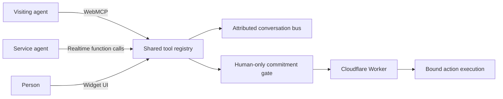

# Architecture

3way coordinates three participants in one browser session while leaving authoritative
execution on the server. This document maps every stage to the implementation that owns it.

### Keyholder mode — the default

The person-facing surface has two modes. Keyholder (the default) renders no text
composer: the agents transact over the shared bus described below, and the person's only
affordance is the hardware-gesture confirmation a gated tool requires. Composer mode
restores a text box so the person can also contribute to the thread — the clinic demo
selects it because its disclosure flow needs facts only the person can supply.

The flag path is one hop per layer, defaulting to `false` (Keyholder) at every one:
`data-3way-input` → `WidgetConfig.composer` → `mount()` → `createModal()`.

## Participants and ingress paths

The person enters through the widget UI, the visiting agent through WebMCP, and the
service agent through an OpenAI Realtime WebRTC session. [`packages/widget/src/index.ts`](../packages/widget/src/index.ts)
assembles all three paths. [`packages/widget/src/webmcp.ts`](../packages/widget/src/webmcp.ts)
registers the visiting-agent tools, [`packages/widget/src/session.ts`](../packages/widget/src/session.ts)
owns the service-agent session, and [`packages/widget/src/ui/modal.ts`](../packages/widget/src/ui/modal.ts)
owns the person-facing transcript and controls.

Ingress is stamped with one of the origins declared in
[`packages/widget/src/types.ts`](../packages/widget/src/types.ts): `human-direct`,
`agent-relay`, `agent-autonomous`, or `site-agent`. The stamp says which 3way path produced
an entry. It is not independent identity verification.

## One conversation bus

[`packages/widget/src/bus.ts`](../packages/widget/src/bus.ts) stores the ordered `LogEntry`
list, assigns IDs and timestamps, publishes entries to subscribers, and offers cursor reads.
[`packages/widget/src/index.ts`](../packages/widget/src/index.ts) creates one bus per mounted
widget. [`packages/widget/src/session.ts`](../packages/widget/src/session.ts) subscribes the
service agent to that bus, while [`packages/widget/src/ui/modal.ts`](../packages/widget/src/ui/modal.ts)
renders the same entries for the person.

## One registry, three consumers

The shop registry is built in [`packages/widget/src/tools.ts`](../packages/widget/src/tools.ts);
the clinic registry in [`packages/widget/src/clinic.ts`](../packages/widget/src/clinic.ts)
reuses the same gateway. [`packages/widget/src/index.ts`](../packages/widget/src/index.ts)
routes a registry to WebMCP, the Realtime session, and the widget's direct human execution
path.

“One registry” means one implementation per domain tool with consumer-specific views, not
identical permissions for every participant. `scopeFor` in
[`packages/widget/src/tools.ts`](../packages/widget/src/tools.ts) gives the visiting agent
the full domain view and removes `send_message`, `provide_context`, and `await_reply` from
the service agent. The person does not impersonate either agent; the widget calls the
already-registered gated implementation with `origin: 'human-direct'` after confirmation.

## Visiting-agent WebMCP path

[`packages/widget/src/webmcp.ts`](../packages/widget/src/webmcp.ts) prefers
`document.modelContext`, supports the older `navigator.modelContext`, and treats absence as
a nonfatal no-WebMCP tier. It registers tool descriptors asynchronously, converts thrown
tool errors to structured results, reports registration rejection, and unregisters the set
through one `AbortController`.

Before registration, [`packages/widget/src/index.ts`](../packages/widget/src/index.ts)
wraps the visiting-agent view with `withPiggyback` from
[`packages/widget/src/tools.ts`](../packages/widget/src/tools.ts). That wrapper maintains a
per-consumer cursor and adds `room_since_last_call` to each result.

## Service-agent Realtime path

[`packages/widget/src/session.ts`](../packages/widget/src/session.ts) converts the scoped
registry to Realtime function definitions, mints a client secret through the Worker, opens
a WebRTC data channel, and rebuilds the model's context from the bus after reconnects. It
executes calls with `origin: 'site-agent'`, contains tool failures, and uses a response
guard so function-call continuations and concurrent turns do not collide.

The domain-specific service instructions come from
[`packages/widget/src/prompt.ts`](../packages/widget/src/prompt.ts) and the stance maps in
[`config/stances.ts`](../config/stances.ts) or [`config/clinic.ts`](../config/clinic.ts).
Prompts influence presentation and reasoning; they are not authorization checks.

## Human interaction path

[`packages/widget/src/ui/modal.ts`](../packages/widget/src/ui/modal.ts) renders origin and
assurance metadata, accepts typed person messages, exposes pending confirmation subjects,
and rejects synthetic clicks whose `isTrusted` is false. Typed text is appended through
`sendUserText` in [`packages/widget/src/session.ts`](../packages/widget/src/session.ts) as
`human-direct`.

After a confirmation ceremony succeeds, [`packages/widget/src/index.ts`](../packages/widget/src/index.ts)
calls the gated registry function itself with `origin: 'human-direct'`. Agent-origin calls
may prepare requests and later read receipts, but cannot spend the confirmation.

## Structured handoffs and continuation

The missing-information result is implemented by `request_records_disclosure` in
[`packages/widget/src/clinic.ts`](../packages/widget/src/clinic.ts). The human-confirmation
result comes from [`packages/widget/src/gates.ts`](../packages/widget/src/gates.ts).
Awaiting-execution results, terminal receipts, bounded receipt retention, and transcript
piggybacking live in [`packages/widget/src/tools.ts`](../packages/widget/src/tools.ts).

Both domain registries implement `await_reply`; it blocks for 25 seconds by default, 30 at
most, and wakes on a new bus entry. The entries themselves still return through
`room_since_last_call`. The gated tools additionally hold a refused visiting-agent call
open — for a separate 25-second bound, one hold per request, resolved directly by the human path's completion — so the call that
requested the action is the one answered with its receipt; the widget narrates the wait to
the person once. The shapes and the executor path are unchanged; see
[`docs/WEBMCP.md`](WEBMCP.md), "Holding a refused call open".
The measured behavior and its limits are recorded in
[`docs/research/await-reply-trial.md`](research/await-reply-trial.md).

## Confirmation and authoritative execution

[`packages/widget/src/gates.ts`](../packages/widget/src/gates.ts) performs an advisory
browser check against the stamped bus. [`packages/widget/src/verify.ts`](../packages/widget/src/verify.ts)
runs WebAuthn registration or authentication, or the explicitly configured lower-assurance
demo path. [`packages/widget/src/session.ts`](../packages/widget/src/session.ts) writes the
confirmation with `confirms`, `confirmsTool`, and any `verification` proof.

[`worker/src/index.ts`](../worker/src/index.ts) is authoritative. It binds the action subject
before the ceremony, verifies the WebAuthn response, mints an opaque token for one
`(requestId, tool)` pair, rechecks the current assurance policy and domain eligibility, and
dispatches one bound action implementation. The browser sends only `tool`, `requestId`, and
the token on the strong `/api/act` path; action fields supplied again at execution are
ignored.

## Shop and clinic domain adapters

[`packages/widget/src/tools.ts`](../packages/widget/src/tools.ts) defines catalogue, order,
return, cancellation, address, and account-record tools. Its data and policy come from
[`config/seed.ts`](../config/seed.ts) and [`config/policy.ts`](../config/policy.ts).

[`packages/widget/src/clinic.ts`](../packages/widget/src/clinic.ts) substitutes visits,
disclosure preparation, recipient questions, and records release over the same gateway.
[`config/clinic.ts`](../config/clinic.ts) supplies fictional visits, restricted categories,
release documents, and clinic policy. [`packages/widget/src/eligibility.ts`](../packages/widget/src/eligibility.ts)
contains the deterministic shop and disclosure decisions used by the browser and Worker.

## Deployment topology

[`scripts/build-site.sh`](../scripts/build-site.sh) assembles `site/`, the shop demo, the
clinic demo, the probe, and the versioned widget into `dist-site/` for Cloudflare Pages.
[`worker/wrangler.jsonc`](../worker/wrangler.jsonc) configures the Cloudflare Worker,
relying-party ID, allowed origins, Realtime model, and KV binding.

The browser receives static page and widget assets from Pages. It calls the Worker for
configuration, demo data, Realtime client secrets, confirmation ceremonies, and bound
actions. The Worker alone holds the OpenAI API key and the records returned only after a
gated disclosure. See [Assurance and Security Boundary](SECURITY.md) for the exact trust
claims and deployment caveats.
